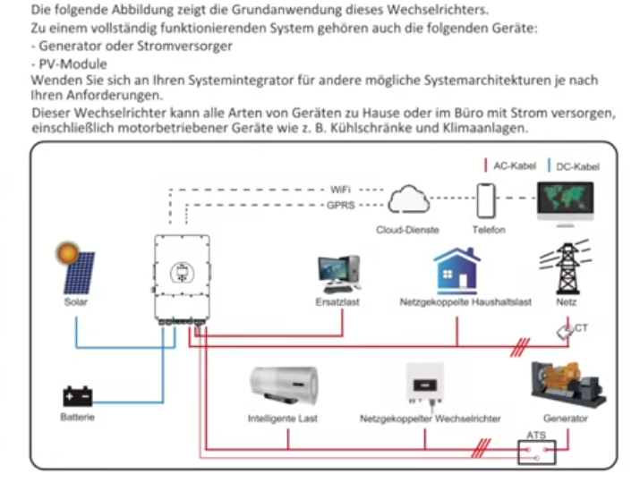

############
Akkuspeicher
############

Händler
=======

`Sheyzen: SOEC Energy <https://www.soecenergy.com/>`_
-----------------------------------------------------

SOEC 48V /51,2V 300Ah LiFePO4-Batterie 15kWh Lithium-Ionen-Batterie-Energiespeichersystem für Mobilheime
(4)View

Versand aus China (40-60 Tage), kostenloser Versand und kostenlose Steuern. Robuste Schweißtechnik. Eingebautes aktives Balancer-Modul + externer physischer Schalter. Eingebauter professioneller temperaturempfindlicher LiFePO4-Feuerlöscher. 100 % Zellen der Klasse A+. Einfache Bewegung auf vier Rädern. Automatische Auslösevorrichtung zur Vermeidung von Stromschlägen. 6000+ Zyklen, 90 % DOD, integriertes BMS, 10 Jahre Lebensdauer.

€2,861.95 (9.4.2025)

BMS
===

JK BMS t.b.d.

Wechselrichter
==============

DEYE SUN-12K-SG04LP3-EU / Wifi
------------------------------

3-phasiger Hybrid-Wechselrichter. Interessant, da der bestehende Wechselrichter am Generatoreingang angeschlossen werden kann. Die Nord-PV-Anlage kann dann vermutlich an den PV-Eingang ran, mehr als 12kW sind da nicht zu erwarten.

.. seealso::

	* https://www.youtube.com/watch?v=i1oa_EbWJPI
	* https://www.youtube.com/watch?v=Hj5VTs9gGPg
	* `Deye Benutzerhandbuch <https://de.deyeinverter.com/deyeinverter/2023/03/24/rand/9271/%E3%80%90B%E3%80%91%E4%BD%BF%E7%94%A8%E8%AF%B4%E6%98%8E%E4%B9%A6-%E5%82%A8%E8%83%BD%E4%B8%89%E7%9B%B8-SUN-(5-12)K-SG04LP3-EU-%E5%BE%B7%E4%B8%9A%E5%BE%B7%E8%AF%AD.pdf>`_

   DEYE SUN-12K-SG04LP3-EU / Wifi
