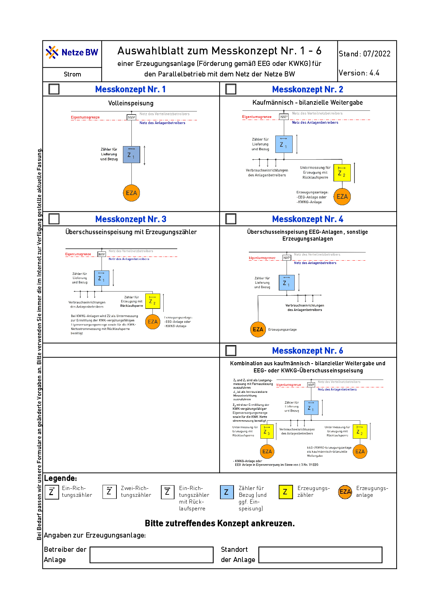
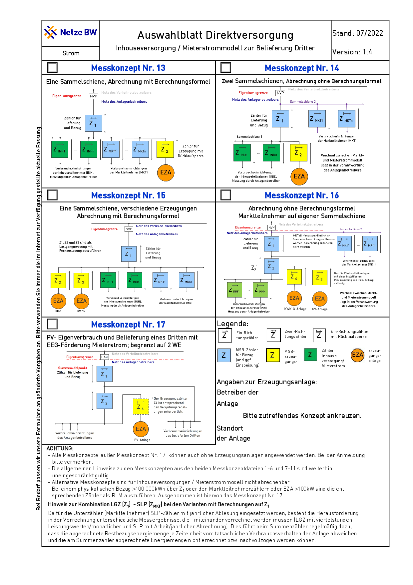
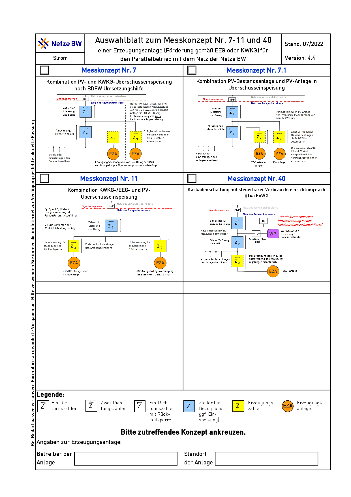
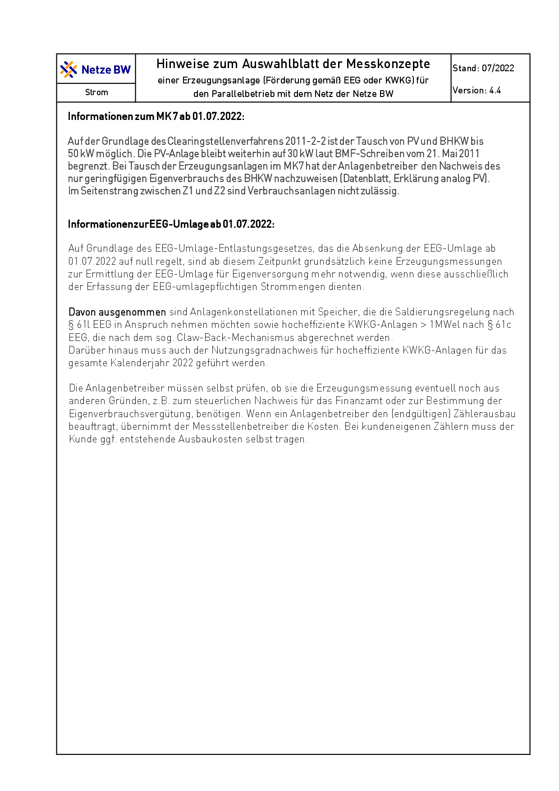
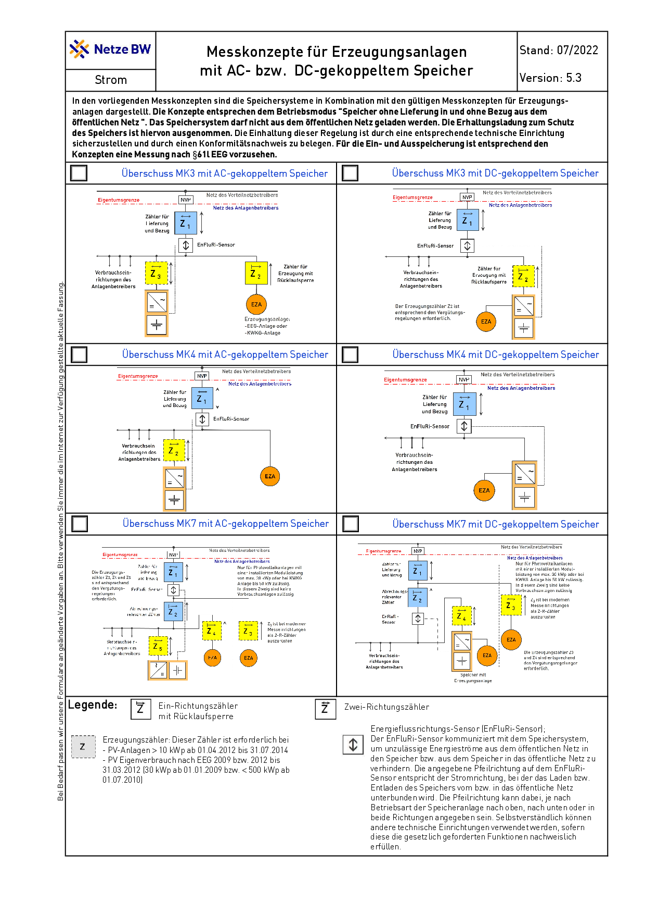
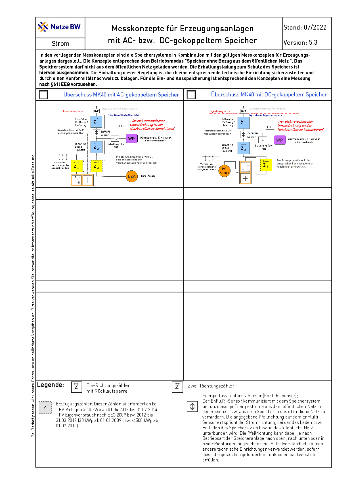

######################
Anmeldung der Anlagen
######################

Antrag auf Anschluss einer PV-Anlage per Mail
=============================================

Auf Anraten von Beiträgen im Photovoltaikforum erfolgt die Anmeldung im ersten Schritt über eine Mail an kontakt ät netze-bw.de. Die Anmeldung über das Online-Portal der Netze-BW benötigt viele Kenntnisse, die zum aktuellen Zeitpunkt noch nicht vorliegen und vermutlich auch nur vom Elektrofachbetrieb beigesteuert werden können.

.. epigraph::

	Netzanschlussbegehren als Erweiterung der bestehenden PV-Anlage 04...

	Sehr geehrte Damen und Herren,

	ich begehre den Anschluss einer in Planung befindlichen PV-Anlage mit einer Nennleistung von ca. 17 kWp in nördlicher Dachausrichtung am Standort Merowingerstraße 6, 78662 Bösingen (privates Einfamilien-Wohnhaus). Ich gehe auf Grund der nördlichen Ausrichtung von einer Einspeisung von maximal 70% der Nennleistung der Module, also maximal ca. 12 kWp aus. Basis für die Einspeisung ist die aktuell gültige Version des Gesetzes zur Einspeisevergütung bei Inbetriebnahme ab 1. Februar 2024 bis 31. Juli 2024 (§ 21 Abs. 1, § 53 Abs. 1 EEG)

	Die Anlage dient dem Eigenverbrauch und der Netzeinspeisung, es ist ein Akkuspeicher mit einer Kapazität von 24kWh angeschlossen.

	Es besteht bereits eine Anlage auf der südlichen Dachfläche. Die Daten zur bestehenden  Anlage sind:

	| MaStR-Nr. der Einheit: SEE...,
	| Vertragskonto: V8...
	| Vertragsnummer: 30...
	| Anlagennummer: 04...
	| Anlagenschlüssel: E1...
	| PV-Anlage 12,600 kWp
	| Zähler 1EMH... / 1EMH...

	Bitte bestätigen Sie mir den Empfang und die Korrektheit dieser Anmeldung und schicken Sie mir unverzüglich einen genauen Zeitplan für die Bearbeitung des Netzanschlussbegehrens. Vielen Dank!

	Mit freundlichen Grüßen

	Adresse

Antrag über das Online-Portal
=============================

Die PV Anlage muss vor Inbetriebnahme bei Netze-BW angemeldet werden. Die Anmeldung erfolgt über das Online-Portal der Netze-BW. Die Anmeldung ist kostenfrei.

Ermittlung der Gesamtleistung der PV-Module
===========================================

Zuerst muss die Gesamtleistung der PV-Module, die an den Wechselrichter angeschlossen werden sollen, berechnet werden. Dies errechnet sich üblicherweise durch Multiplikation der Anzahl der Module mit der Nennleistung eines jeden Moduls:

.. epigraph::

	P\ :sub:`total` = n × P\ :sub:`modul`

wo n die Anzahl der Module und P\ :sub:`modul` die Nennleistung eines Moduls in Watt ist.

.. epigraph::

	P\ :sub:`total` = 52 x 330W = 17160 = 17,16kW

Berücksichtigung der PV-Modul-Leistungstoleranz
===============================================

Die tatsächliche Leistung der PV-Module kann aufgrund von Leistungstoleranzen variieren. Meist liegt die Toleranz im Bereich von -0% bis +5%. Es ist ratsam, die maximale Leistung zu berücksichtigen, um sicherzustellen, dass der Wechselrichter auch bei höherer Modulleistung angemessen funktioniert.

Die Leistungstoleranz der Heckert 330 W Module beträgt `0 / +4,99 Wp`. Die maximale Leistung der Module beträgt daher 330 + 4,99 = 334,99 Wp.

.. epigraph::

	P\ :sub:`total` = P\ :sub:`AGen` = 56 x 334,99W = 18747,44W = 18,75kW

Wahl der Wechselrichterleistung
===============================

Der Wechselrichter sollte so gewählt werden, dass seine Nennleistung die Spitzenleistung der PV-Module aufnehmen kann, aber nicht zu groß dimensioniert ist, da dies zu einer ineffizienten Betriebsweise führen kann. Die Leistung des Wechselrichters sollte daher in etwa der maximalen Leistung der PV-Module entsprechen oder diese leicht übersteigen.

Überlegungen zur Umrichterscheinleistung
========================================

Die **Scheinleistung** `S` eines Wechselrichters ist durch seine Fähigkeit bestimmt, **Wirkleistung** und **Blindleistung** zu handhaben. Sie wird normalerweise in **Voltampere (VA)** angegeben und ergibt sich aus der Formel:

.. epigraph::

	S = V × I

wo `V` die Spannung und `I` der Strom ist. Bei der Auswahl eines Wechselrichters muss darauf geachtet werden, dass die Scheinleistung mindestens so hoch ist wie die Gesamtleistung der PV-Module, die in Watt (W) gemessen wird, um sowohl die Wirk- als auch die Blindleistungsanforderungen zu erfüllen.

Einbeziehung von Umweltfaktoren
===============================

Für eine PV-Anlage mit der Ausrichtung Nord und einer Dachneigung von 30 Grad in Deutschland kann von einer Reduktion der Gesamtleistung auf 60,5% ausgegangen werden. Dies bedeutet, dass die tatsächliche Leistung der PV-Module bei diesen Bedingungen 60.5% der Nennleistung beträgt.

.. admonition:: Quelle

	https://photovoltaik.org/solarstrom/solarenergie/neigungswinkel

.. epigraph::

	P\ :sub:`total` = 56 x 334,99W * 0,6050 = 11352,47W = 11,35kW

Antrag: Leistungsangaben der Erzeugungsanlage(n)
===============================================

Die Leistungsangaben der Erzeugungsanlage(n) müssen im Antrag angegeben werden:

Geplante (Modul-) Leistung P\ :sub:`AGen` (Summenleistung aller Module):
	Die geplante (Modul-) Leistung P\ :sub:`AGen` (Summenleistung aller Module) beträgt **17,16 kW**.

Bemessungsscheinleistung aller geplanten Erzeugungseinheiten (Umrichterscheinleistung) ΣS\ :sub:`r,E`
	Die Bemessungsscheinleistung aller geplanten Erzeugungseinheiten (Umrichterscheinleistung) ΣS\ :sub:`r,E` beträgt 10 kW.

Maximale Wirkleistung aller geplanten Erzeugungseinheiten (Umrichterwirkleistung) ΣP\ :sub:`Emax`
	Die maximale Wirkleistung aller geplanten Erzeugungseinheiten (Umrichterwirkleistung) ΣP\ :sub:`Emax` beträgt 10 kW.

Anschlusswirkleistung der existierenden Anlage
[X] Es ist ein Speichersystem geplant:
Maximale Wirkleistung aller geplanten Speicher ΣPEmax

Leistungsangaben der Erzeugungsanlage(n)
Geplante (Modul-) Leistung PAGen (Summenleistung aller Module)

Bemessungsscheinleistung aller geplanten Erzeugungseinheiten (Umrichterscheinleistung) ΣS :sub:`r,E`

Die Bemessungsscheinleistung aller geplanten Erzeugungseinheiten (Umrichterscheinleistung) ΣS r,E beträgt 10 kW.

Maximale Wirkleistung aller geplanten Erzeugungseinheiten (Umrichterwirkleistung) ΣP :sub:`Emax`

Anschlusswirkleistung der existierenden Anlage

[X] Es ist ein Speichersystem geplant:
Maximale Wirkleistung aller geplanten Speicher ΣPEmax

Messkonzepte
=============

Im Rahmen der Beantragung muss ein Messkonzept angegeben werden. Dies ist die Auswahl:

.. hint::

	Da generell keine Erzeugungsmessung (zB Erzeugungszähler) mehr nötig ist können Wechselrichter an Verteiler dezentral im Hausnetz angeschlossen werden.

	Das kann z.B. eine bisher einzelne CEE-Dose oder ein Endstromkreis sein - häufig in Nebengebäuden, Garage, Schuppen zu finden.

	Zuleitung -> UV, darin parallel RCD und Sicherung(en) für WR. Am RCD wird der Bestand mit neuer Sicherung angeschlossen.

	Quelle: `Photovoltaikforum <https://www.photovoltaikforum.com/wissen/entry/2-faq-wertvolle-informationen-zu-pv-anlagengr%C3%B6%C3%9Fe-stromspeicher-wirtschaftlichkeit/#25c7c7c0-beispiel-f%C3%BCr-46-module-%C3%A0-400-wp>`_

.. attention::

	Warnung: Netze BW GmbH versucht spätestens bei einer zweiten Anlage unnötige Zähler vorzuschreiben und für Betreiber nachteiligen Vertrag zu erwirken.

	Von NetzeBW gewünschte Vereinbarungen wie "Die 'Allgemeinen Bestimmungen für die Stromeinspeisung in das Netz der Netze BW GmbH' sind Bestandteil dieser Erklärung" keinesfalls unterschreiben!

	Quelle: `Photovoltaikforum <https://www.photovoltaikforum.com/wissen/entry/2-faq-wertvolle-informationen-zu-pv-anlagengr%C3%B6%C3%9Fe-stromspeicher-wirtschaftlichkeit/#25c7c7c0-beispiel-f%C3%BCr-46-module-%C3%A0-400-wp>`_

.. seealso::

	* https://www.photovoltaikforum.com/wissen/entry/2-faq-wertvolle-informationen-zu-pv-anlagengr%C3%B6%C3%9Fe-stromspeicher-wirtschaftlichkeit/
	* https://www.clearingstelle-eeg-kwkg.de/haeufige-rechtsfrage/68

  