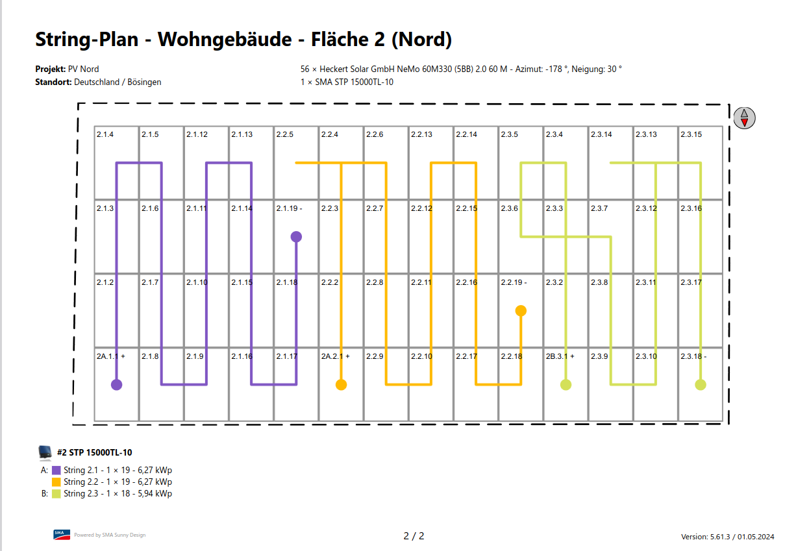

############
Photovoltaik
############

Dimensionierung der Module und des Wechselrichters
===================================================

.. seealso::

	* `Datenblatt DEYE 12k-SG04LP3-EU <https://1drv.ms/b/s!AuFD38gz1WT71SGN35NFi_l0BMt-?e=RhQygr>`_
	* `Handbuch DEYE 12k-SG04LP3-EU <https://1drv.ms/b/s!AuFD38gz1WT71SIVEYCjjWFMLwpx?e=PyeXZm>`_
	* `Datenblatt Heckert Solar NEMO® 2.0 60 M <https://1drv.ms/b/s!AuFD38gz1WT71R8Qvu89cLpJEBCr?e=Wov4ra>`_

Nach der Vermessung des Daches mit Ausrichtung nach Norden ergibt sein ein Preis-/Leistungsoptimum für **Module NEMO® 2.0 60 M** der Firma Heckert Solar mit einer Leistung von 330 Wp pro Modul. Auf die Fläche passen 14 Spalten in 4 Reihen mit einer Abmessung von **1670 x 1006 x 38 mm**. Zu berücksichtigen ist eine Montageklammer, die die Module auf einem Abstand von 20mm hält.

Die Module werden in Serie an die 3 Strings des Wechselrichters **Deye SUN-12K-SG04LP3-EU** angeschlossen. Dieser hat eine maximale DC-Eingangsspannung von 800 V und einen MPP-Spannungsbereich von 200-650 V pro String.

.. pull-quote::

	Wie viele Module können in einem String angeschlossen werden und wie viele Module werden insgesamt auf dem Dach installiert?

Um die Anzahl der Module pro String zu bestimmen, müssen wir zunächst die maximale Anzahl von Modulen berechnen, die in einem String angeschlossen werden können, ohne die maximale DC-Eingangsspannung des Wechselrichters zu überschreiten.

Gegebene Daten:

- Modulmodell: **Heckert Solar NEMO® 2.0 60 M**
- Modulleistung: **330 Wp**
- Leerlaufspannung U\ :sub:`oc`: **41,1 V**
- Spannung bei Maximalleistung U\ :sub:`mp`: **33,55 V**

- Wechselrichtermodell: **DEYE SUN-12K-SG04LP3-EU**
- Maximale DC-Eingangsspannung des Wechselrichters: **800 V**
- MPP-Spannungsbereich des Wechselrichters: **200-650 V** pro String
- **3 Strings** insgesamt

Optimaler Aufbau bei diesen Komponenten:

- Spalten: **14**
- Reihen: **4**
- Module in Summe **56**
- 2 Strings à **19** Module
- 1 String a **18** Module

Daraus ergeben sich diese Maximalwerte:

* Leerlaufspannung = 19 * 41,1 V = **780,9 V**
* Spannung bei Maximalleistung = 19 * 33,55 V = **638,45 V**

.. admonition:: Ergebnis

	Die Leerlaufspannung von 780,9 V liegt innerhalb des maximalen DC-Eingangsspannungsbereichs des Wechselrichters von 800 V pro String.

	Die Spannung bei Maximalleistung von 638,45 V liegt ebenfalls innerhalb dieses Bereichs und ist auch innerhalb des MPPT Spannungsbereichs von 200 - 650 V

	Durch Verwendung des Systems auf der Nordseite ist davon auszugehen, dass ein ausreichender Abstand zur maximalen Leistung besteht, sodass keine Einbußen in Lebensdauer und Leistung erwartet werden.

Anordnung der Module auf dem Dach
----------------------------------

Eine Anordnung der 3 Strings von Ost nach West (vertikale Ausrichtung) ist empfehlenswert, um die Sonneneinstrahlung in den Morgen- und Abendstunden optimal zu nutzen. Da das Dach nach Norden ausgerichtet ist, kann die vertikale Anordnung helfen, die Effizienz zu steigern, indem sie eine breitere Abdeckung des Himmels ermöglicht.

Das Programm Sunny Design von SMA hilft bei der genauen Planung und Ausrichtung der Module auf dem Dach helfen. Es berücksichtigt die spezifischen Gegebenheiten des Standorts und zeigt Ihnen die optimale Anordnung der Module, um die Leistung zu maximieren.

	Modulausrichtung mit Sunny Design

Zugrundeliegende Überlegungen
=============================

Leerlaufspannung U\ :sub:`oc`
-----------------------------

.. pull-quote::

	Wie verhält sich die Leerlaufspannung U\ :sub:`oc` in Abhängigkeit von der Sonneneinstrahlung, konkret bei 70% Leistung der PV-Module, wenn sie auf der Nordseite installiert sind?

Die Leerlaufspannung U\ :sub:`oc` eines Photovoltaikmoduls ist primär von der Temperatur abhängig, nicht direkt von der Sonneneinstrahlung. Allerdings gibt es eine indirekte Abhängigkeit von der Sonneneinstrahlung über die Temperaturerhöhung des Moduls bei starker Sonneneinstrahlung.

Hier sind die grundlegenden Zusammenhänge:

1. **Temperaturabhängigkeit:** Die Leerlaufspannung U\ :sub:`oc` eines PV-Moduls nimmt mit steigender Modultemperatur ab. Bei geringerer Sonneneinstrahlung, wie es auf der Nordseite üblich sein kann, sind die Module kühler, was dazu führt, dass die U\ :sub:`oc` tendenziell höher ist als bei Modulen, die starker Sonneneinstrahlung ausgesetzt sind.

2. **Einfluss der Sonneneinstrahlung auf die Leistung:** Die tatsächliche Leistung eines PV-Moduls, die oft als Prozentsatz der maximalen Leistung (z.B. 70%) angegeben wird, wird durch die Intensität der Sonneneinstrahlung bestimmt. Bei geringerer Einstrahlung, wie sie auf der Nordseite vorkommen kann, wird die Spitzenleistung des Moduls reduziert.

Wenn die Leistung eines Moduls bei 70% liegt, bedeutet dies, dass das Modul 70% seiner unter Standard-Testbedingungen (:abbr:`STC (Standard Test Conditions)`) angegebenen Maximalleistung erbringt. Unter diesen Bedingungen kann die Leerlaufspannung etwas von der unter STC gemessenen U\ :sub:`oc` abweichen, bleibt jedoch relativ stabil, solange die Temperatur nicht stark ansteigt. Das bedeutet, dass die U\ :sub:`oc` auch bei reduzierter Leistung relativ hoch bleiben könnte, solange die Module kühler bleiben.

Um genauer zu sein: Die Leerlaufspannung U\ :sub:`oc` würde bei 70% der maximalen Leistung nur unwesentlich von ihrem Standardwert abweichen, da sie hauptsächlich durch Temperaturveränderungen beeinflusst wird. Bei kühleren Bedingungen, wie sie bei einer Nordausrichtung wahrscheinlich sind, könnte die U\ :sub:`oc` tatsächlich etwas höher als erwartet ausfallen.

Modulspannung U\ :sub:`mp`
--------------------------

.. pull-quote::

	Wie verhält sich die Spannung der Module in Abhängigkeit von der Sonneneinstrahlung, also wieder bei angenommenen 70% auf der Nordseite?

Die Spannung eines Photovoltaikmoduls, insbesondere unter realen Betriebsbedingungen, wird durch mehrere Faktoren beeinflusst, darunter die Sonneneinstrahlung, die Temperatur des Moduls und die Last, an die es angeschlossen ist. Hier ist, wie sich diese Faktoren im Kontext Ihrer Frage nach dem Verhalten der Modulspannung bei 70% der Leistung auf der Nordseite auswirken können:

1. **Sonneneinstrahlung und Modulspannung:**

   - Die Spannung eines PV-Moduls unter Last, auch bekannt als Betriebsspannung U\ :sub:`mp`, wird tatsächlich weniger von Veränderungen der Sonneneinstrahlung beeinflusst als der Strom. U\ :sub:`mp` bleibt relativ stabil, solange das Modul innerhalb eines normalen Betriebstemperaturbereichs operiert.

   - Bei geringerer Sonneneinstrahlung, wie sie für eine Nordausrichtung typisch ist, produziert das Modul weniger Strom, aber die Spannung bleibt relativ nah an der Leerlaufspannung U\ :sub:`oc`, solange nicht extrem niedrige Lichtverhältnisse vorliegen.

2. **Leistung bei 70%:**

   - Wenn ein Modul bei etwa 70% seiner Maximalleistung arbeitet, impliziert dies, dass es etwa 70% des maximal möglichen Stroms bei einer bestimmten Betriebsspannung produziert. Die Betriebsspannung selbst würde dabei nicht stark von der unter Standard-Testbedingungen abweichen, sofern keine extremen Temperaturen oder andere abweichende Umstände vorliegen.

3. **Einfluss der Temperatur:**

   - Kühle Bedingungen, wie sie oft auf der Nordseite zu finden sind, können dazu führen, dass die Betriebsspannung des Moduls etwas höher bleibt, da die Temperaturabnahme dazu führt, dass die Spannung weniger stark fällt. Dies ist insbesondere im Vergleich zu Modulen der Fall, die starker Sonneneinstrahlung und damit höheren Temperaturen ausgesetzt sind.

Zusammenfassend lässt sich sagen, dass bei 70% der Leistung auf der Nordseite die Spannung der Module relativ stabil nahe der U\ :sub:`oc` bleibt, vorausgesetzt, die Module sind nicht extremen Temperaturen oder abnormalen Betriebsbedingungen ausgesetzt. Der Stromausgang wäre reduziert, was den größten Einfluss auf die Reduktion der Gesamtleistung hat, während die Spannung weniger stark beeinflusst wird.

Welche Auswirkung hat es, wenn die Summe der U\ :sub:`mpp` der Module ca. 5% über dem obersten MPPT Wert des Wechselrichters liegt? (Die Anlage ist nach Norden ausgerichtet und wird nur unter 70% der maximalen Leistung bringen.)

Wenn die Summe der U\ :sub:`mpp` (Spannung bei maximaler Leistung) der Photovoltaikmodule den obersten :term:`MPPT`-Wert des Wechselrichters übersteigt, auch nur um etwa 5%, kann dies mehrere Auswirkungen auf das System haben, insbesondere unter den Bedingungen einer Nordausrichtung und einer Leistung, die typischerweise unter 70% der maximalen Leistung bleibt:

1. **Reduzierte Effizienz:** Der Wechselrichter kann nicht optimal arbeiten, wenn die Eingangsspannung seine technischen Grenzen überschreitet. Er ist möglicherweise nicht in der Lage, die maximale Leistung aus den Modulen herauszuholen, was zu einer geringeren Gesamteffizienz des Systems führt.

2. **Risiko der Abschaltung:** Viele Wechselrichter haben Sicherheitsmechanismen, die das Gerät abschalten, wenn die Eingangsspannung einen bestimmten Schwellenwert übersteigt. Dies schützt die interne Elektronik des Wechselrichters vor Überlastung und Schäden. Wenn die Spannung der Module regelmäßig den maximalen :term:`MPPT`-Bereich des Wechselrichters überschreitet, kann dies zu häufigen Abschaltungen führen.

3. **Langzeitbelastung und -schäden:** Selbst wenn der Wechselrichter kurzzeitig mit einer leicht erhöhten Eingangsspannung umgehen kann, kann eine kontinuierliche Überlastung über den empfohlenen Bereich hinaus zu einer erhöhten Verschleißrate und potenziell zu vorzeitigem Ausfall der Geräte führen.

4. **Reduzierte Energieproduktion:** Da der Wechselrichter nicht in der Lage ist, kontinuierlich im optimalen Spannungsbereich zu arbeiten, könnte die Gesamtleistung der Anlage geringer sein, als sie unter idealen Umständen sein könnte.

Für Ihre spezifische Situation, in der die Anlage nach Norden ausgerichtet ist und nur etwa 70% der maximalen Leistung erreicht, bedeutet dies:

- Die Module könnten an Tagen mit voller Sonneneinstrahlung (obwohl dies auf der Nordseite seltener vorkommt) höhere Spannungen erreichen, die den Wechselrichter überfordern könnten.

- Allerdings, da die erwartete Durchschnittsleistung der Module unter den maximalen Bedingungen bleibt, könnten die Spitzen der Modulspannung, die den :term:`MPPT`-Bereich überschreiten, nicht häufig genug auftreten, um ernsthafte Probleme zu verursachen, solange sie nur knapp über dem Limit liegen.

Anordnung der Module und Strings
--------------------------------

Für ein Setup mit vier Reihen à 14 Modulen und insgesamt 56 Modulen, die auf drei Strings aufgeteilt werden müssen, hier einige Überlegungen:

Anordnung der Strings:
	Das System hat 2 Strings mit jeweils 19 Modulen und einen String mit 18 Modulen.
	Da keine Verschattung vorliegt und die Module in Nordausrichtung montiert werden, ist es wichtig, eine möglichst effiziente Nutzung der Modulfläche zu gewährleisten.

Vertikale vs. horizontale Anordnung:
	Vertikale Anordnung (von Ost nach West): Diese Anordnung könnte vorteilhaft sein, um das Licht in den Morgen- und Abendstunden besser einzufangen, wenn die Sonne tiefer steht. Da die Module in Nordrichtung ausgerichtet sind, kann die vertikale Anordnung helfen, die Effizienz zu steigern, indem sie eine breitere Abdeckung des Himmels ermöglicht.
	Horizontale Anordnung (von oben nach unten): Diese Konfiguration kann die Installation vereinfachen, da sie oft leichter an die typische Form von Dachziegeln angepasst werden kann. Sie bietet jedoch möglicherweise nicht die optimale Ausnutzung der verfügbaren Sonneneinstrahlung, besonders früh und spät am Tag.

Empfehlung:
	Aufgrund der Nordausrichtung und der Möglichkeit, das Licht am Morgen und Abend optimal zu nutzen, wäre eine vertikale Anordnung der Strings empfehlenswert. Dadurch könnten die Module effektiver die verfügbare Sonneneinstrahlung zu diesen Zeiten einfangen.