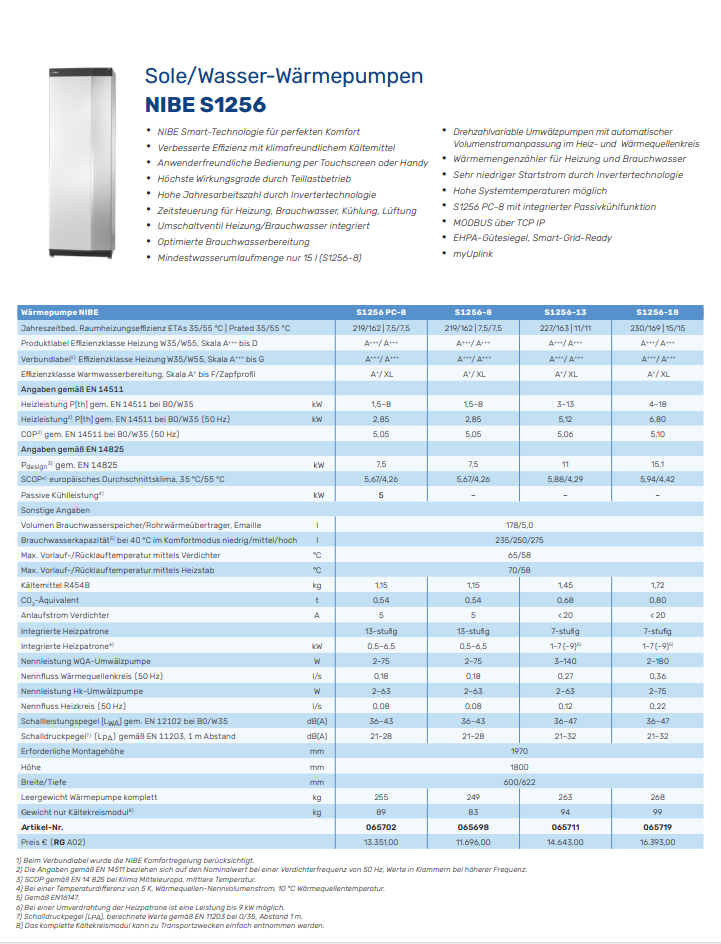
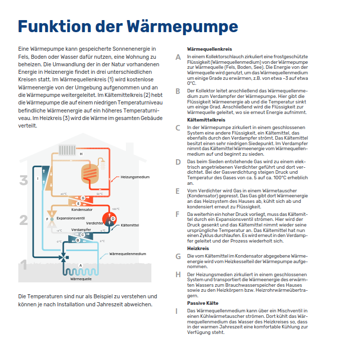
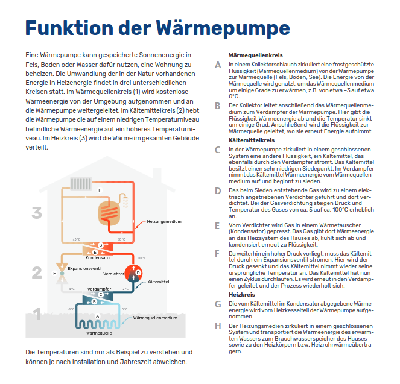
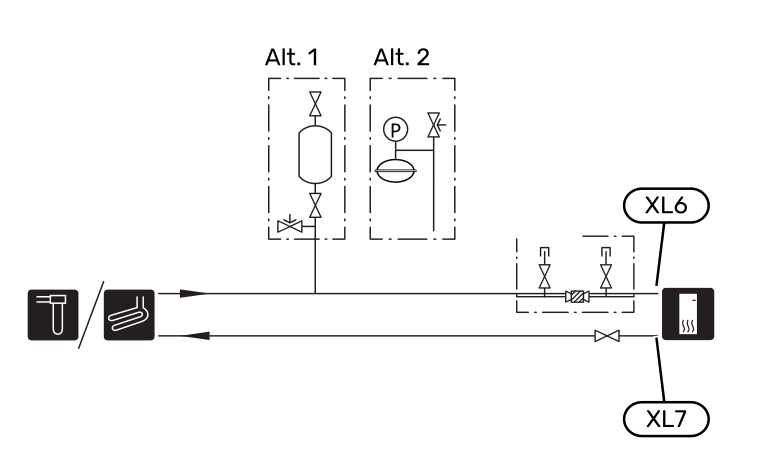

###########
Wärmepumpe
###########

Die Wärmepumpe ist ein Gerät, das Wärme von einem kälteren auf ein wärmeres Temperaturniveau transportiert. Dieser Prozess wird durch den Einsatz von elektrischer Energie ermöglicht. Die Wärmepumpe ist ein thermodynamisches System, das auf dem Prinzip des Carnot-Prozesses basiert. Die Wärmepumpe besteht aus einem Verdampfer, einem Kompressor, einem Kondensator und einem Expansionsventil. Der Verdampfer nimmt Wärme aus der Umgebung auf und verdampft das Kältemittel. Der Kompressor erhöht den Druck des Kältemittels und erhöht die Temperatur. Der Kondensator gibt die Wärme an die Umgebung ab und kondensiert das Kältemittel. Das Expansionsventil senkt den Druck des Kältemittels und senkt die Temperatur, um den Prozess zu wiederholen. Die Wärmepumpe kann für die Heizung und Kühlung von Gebäuden sowie für die Warmwasserbereitung eingesetzt werden. Die Wärmepumpe ist eine effiziente und umweltfreundliche Heizungs- und Kühllösung, da sie die Umgebungswärme nutzt und weniger Energie verbraucht als herkömmliche Heizungs- und Kühlsysteme.

	

Drosselung
==========

Die Wärmepumpe ist für eine Heizleistung von 13 KW ausgelegt, der Ringspeicherkollektor nur auf ca. 11 KW. Vom Lieferanten des Ringspeicherkollektors wird dazu geraten, die Wärmepumpe auf 11 KW zu drosseln. Das ist laut Wärmepumpenhersteller möglich über die HZ Zahl.

Allerdings moduliert diese auch nicht auf 13 KW, wenn das nicht gebraucht wird, sonder immer von ganz unten nach oben.

Vom Heizungsbauer kommt auch Entwarnung:

.. epigraph::

	Die Wärmepumpe regelt von 3 KW bis 13 KW  stufenlos, da braucht man nichts zu drosseln! Die läuft sowieso nur wenn Stromfreigabe ist und dann meistens vielleicht halbe Leistung! Und wenn die mal ein paar Tage 13 KW läuft, dann macht das dem Kollektor auch nichts!

Kühlfunktion
============

Neben der NIBE 1256-13 gibt es auch die NIBE 1256PC-8. Diese beinhaltet eine mögliche Kühlfunktion. Für die NIBE 1256-13 kann die Kühlfunktion über Zubehör erreicht werden. 

	
	NIBE 1256PC-8

	
	NIBE 1256-13

Systemprinzip 
=============

Die S1256 besteht aus Wärmepumpe, Brauchwasserspeicher, Elektroheizpatrone, Umwälzpumpe und Regelgerät. S1256 wird mit einem Wärmequellen- bzw. Heizkreis verbunden. 

Im Verdampfer der Wärmepumpe gibt das Wärmequellenmedium (Frostschutzflüssigkeit, z.B. Ethanol oder Glykol gemischt mit Wasser) seine Energie an das Kältemittel ab. Dieses wiederum wird verdampft und im Verdichter komprimiert. Dort erhöht sich die Temperatur des Kühlmittels und es wird weiter in den Kondensator geleitet, wo es seine Energie an den Heizkreis und bei Bedarf an den Brauchwasserspeicher abgibt. Wenn ein größerer Bedarf an Wärme bzw. Brauchwasser vorliegt, als der Verdichter allein decken kann, wird eine integrierte Elektroheizpatrone zugeschaltet.

.. seealso:: 
	* :download:`S1256 Benutzerhandbuch </_static/datenblaetter/NIBE-S1256-Benutzerhandbuch.pdf>`
	* :download:`S1256 Installateurhandbuch </_static/datenblaetter/NIBE-S1256-Installateurhandbuch.pdf>`

Montage 
=======

#. Isolieren Sie alle Wärmequellenleitungen im Innenbereich gegen Kondensation.

#. mitgeliefertes Niveaugefäß (:index:`CM2`)/Ausdehnungsgefäß: Bringen Sie das Niveaugefäß an der höchsten Stelle des Wärmequellensystems am Eingangsrohr vor der Wärmequellenpumpe an (beziehungsweise 1). Wenn das Niveaugefäß nicht am höchsten Punkt platziert werden kann, muss ein Ausdehnungsgefäß verwendet werden (beziehungsweise 2). 

#. mitgeliefertes Sicherheitsventil (:index:`FL3`). Das Sicherheitsventil ist wie in der Abbildung dargestellt unter dem Niveaugefäß zu montieren.

#. Manometer. Ein Manometer ist nur erforderlich, wenn ein Ausdehnungsgefäß verwendet wird.

#. Absperrventil. Montieren Sie das Absperrventil so dicht wie möglich an S1256.

#. im Lieferumfang enthaltener Filterkugelhahn (:index:`QZ2`). Der Filterkugelhahn wird so dicht wie möglich an S1256 montiert.

#. Entlüftungsventil. Bei Bedarf sollten Sie im Wärmequellensystem Entlüftungsventile installieren.

#. Bei einer Einbindung in Systeme mit Thermostaten ist entweder ein Überströmventil zu installieren oder es sind einige Thermostate abzubauen, damit ein ausreichender Volumenstrom und eine ausreichende Wärmeabgabe gewährleistet werden kann.

#. Das Zubehör :index:`PCS 44` ermöglicht den Anschluss von passiver Kühlung, z.B. mit Gebläsekonvektoren. Das Kühlsystem wird mit dem Wärmequellenkreis der Wärmepumpe verbunden, wobei die Kältezufuhr vom Kollektor über eine Umwälzpumpe und das Mischventil erfolgt

#. für die Passivkühlung ist das :index:`PCM S42` Modul (Artikelnummer 067626) erforderlich. Die Hydraulik wäre dann PL2.003 gem. Anhang, der UKV 100 wird unbedingt benötigt!

#. Der :index:`UKV 100` ist eine große hydraulische Weiche mit Wasserinhalt, welche wir gem. Hydraulik PL2.012 auch komplett umfahren, wenn genug Mindestdurchfluß im Heizungssystem ist.

#. Außenfühler: Der Außenluftfühler (:index:`BT1`) ist an einem schattigen Platz an der Nord- oder Nordwestseite des Hauses zu befestigen, wo keine störende Einstrahlung z. B. durch die Morgensonne erfolgt. Der Außenluftfühler wird an Anschlussklemme AA2-X28:14 und AA2-X29:GND angeschlossen.

#. Raumtemperaturfühler: S1256 wird mit einem Raumfühler (:index:`BT50`) geliefert, durch den es möglich ist, die Raumtemperatur im Display von S1256 abzulesen und zu steuern.

#. Externer Vorlauffühler: Wenn ein externer Vorlauffühler (:index:`BT25`) benötigt wird, ist dieser an Anschlussklemme AA2-X28:12 und an Anschlussklemme AA2-X29:GND anzuschließen.

#. Energiezähler Impuls: Es können bis zu zwei Stromzähler oder Wärmemengenzähler ( :index:`BE6`, :index:`BE7`) via Anschlussklemme AA2-X28:1-2 und AA2-X30:7-8 mit S1256 verbunden werden.

.. seealso:: 
	* :download:`NIBE Wasservorlage </_static/datenblaetter/NIBE-Wasservorlage-24-02-V.1.3.pdf>` 	
	* :download:`S1155 UKV </_static/datenblaetter/nibe_PL2_012_S1255_UKV_9_002.pdf>` 
	* :download:`S1255_PCM_UKV </_static/datenblaetter/nibe_PL2_003_S1255_PCM_UKV.pdf>`

SG ready
========

Wird diese Funktion gewünscht, ist sie mit Anschlussklemme X28 auf der Basisplatine (AA2) zu verbinden. „SG Ready“ ist eine intelligente Art der Tarifsteuerung, bei der der Stromversorger die Innen-, Brauchwasser- und/oder Pooltemperatur (sofern vorhanden) beeinflussen oder die Zusatzheizung und/oder den Verdichter in der Wärmepumpe zu bestimmten Tageszeiten blockieren kann. (Die Auswahl erfolgt in Menü 4.2.3, nachdem die Funktion aktiviert wurde.) 

Zum Aktivieren der Funktion verbinden Sie potenzialfreie Schaltkontakte mit zwei Eingängen, die in Menü 7.4  „Verfügbare Ein-/Ausgänge“ (SG Ready A und SG Ready B) ausgewählt werden. 

Ein geschlossener oder geöffneter Kontakt bewirkt Folgendes:

*	**Blockierung (A: Geschlossen, B: Geöffnet)**

	"SG Ready" ist aktiv. Der Verdichter in S1256 und die Zusatzheizung werden blockiert.

*	**Normalbetrieb (A: Geöffnet, B: Geöffnet)**

	"SG Ready" ist nicht aktiv. Kein Einfluss auf das System.

*	**Niedrigpreismodus (A: Geöffnet, B: Geschlossen)**

	"SG Ready" ist aktiv. Das System strebt eine Kosteneinsparung an und kann z.B. einen kostengünstigen Tarif vom Stromversorger oder eine Überkapazität von einer eventuell vorhandenen eigenen Stromquelle nutzen. (Der Systemeinfluss ist in Menü 4.2.3 einstellbar.)

*	**Überkapazitätsmodus (A: Geschlossen, B: Geschlossen)**

	"SG Ready" ist aktiv. Das System darf mit voller Kapazität arbeiten, wenn beim Stromversorger eine Überkapazität (sehr niedriger Preis) vorliegt. (Der Einfluss auf das System ist in Menü 4.2.3 einstellbar.)

Elektrische Zusatzheizung - maximale Leistung
=============================================

Die Leistung der Elektroheizpatrone kann in Stufen abgerufen werden (vier Stufen, wenn die Elektroheizpatrone für 3x400 V auf maximal 9 kW umgestellt ist), siehe Tabelle. Die Leistung der Elektroheizpatrone wird in Menü 7.1.5.1 - "Interne elektrische Zusatzheizung" eingestellt.

.. list-table:: Elektrische Zusatzheizung für S1256-13 mit 3x230 V
	:widths: 25 25 25 25
	:header-rows: 1
	
	*	- Max. elektr. Zusatzheizung (kW)
		- Max. Phasenstrom L1 (A)
		- Max. Phasenstrom L2 (A)  
		- Max. Phasenstrom L3 (A)

	*	- 0
		- \-
		- \-
		- \-
  
	*	- 2
		- \-
		- 8,7
		- 8,7

	*	- 4
		- 8,7
		- 8,7
		- 15,1

	*	- 6
		- 15,1
		- 15,1
		- 15,1
  
	*	- 9
		- 15,1
		- 27,2
		- 27,3
  